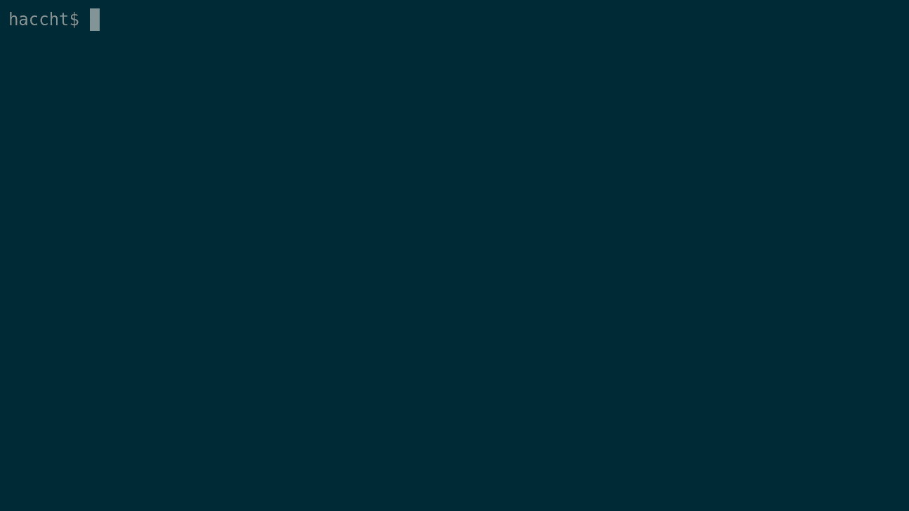

# Todoist Terminal Client

A small [Todoist](https://todoist.com) client on terminal written in Go.



## How to use

```
# build the client yourself
$ go get github.com/haccht/todoist
$ cd $GOPATH/github.com/haccht/todoist/cmd/todoist
$ go build

# and then execute
$ ./todoist
```

You'll be required the Todoist API token for the first run.  
Enjoy!
